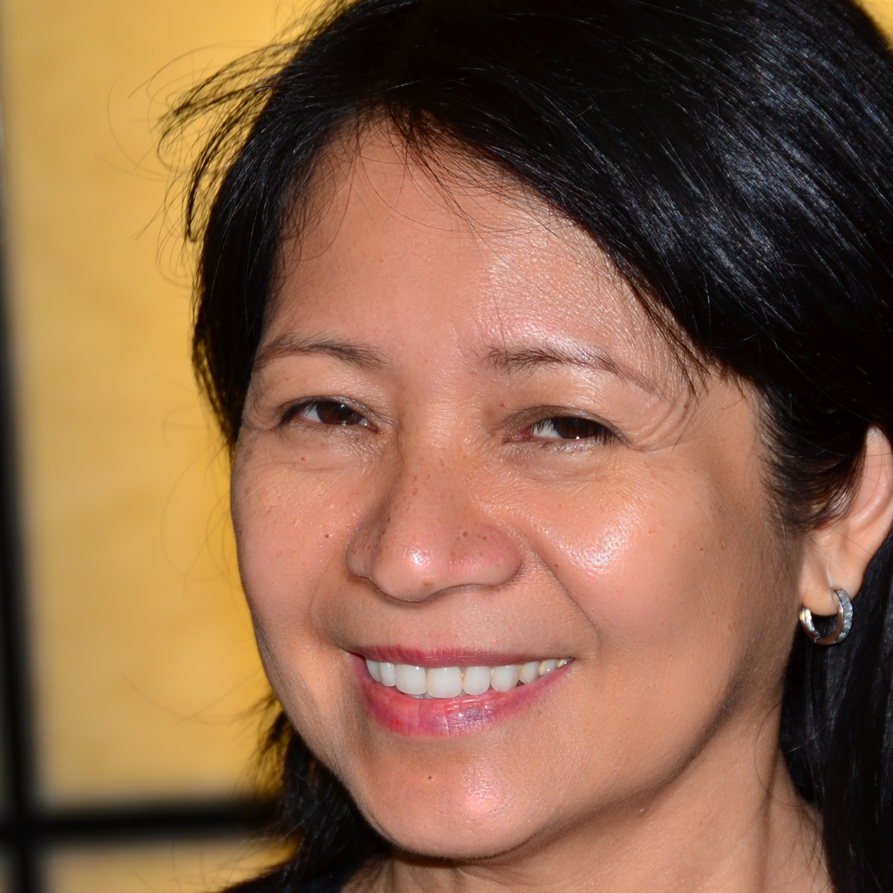

## Introduction
Qwen-Image-Dodge&Burn is a fine-tuned model based on Qwen-Image-Layered, focusing on dodge and burn retouching for photography. 
This model has been released in 'hewei3/qwen-image-dodge_burn' on HuggingFace.

## Requirements
1. At least one A100 GPU is required for running the inference pipeline.
2. Dependencies are listed in `./requirements.txt`

## Examples
Run the test script:
```bash
python src/test.py --image_path 'your_image_path'
```

Comparison of basic and retouched image:

**Basic**


**Retouched**
